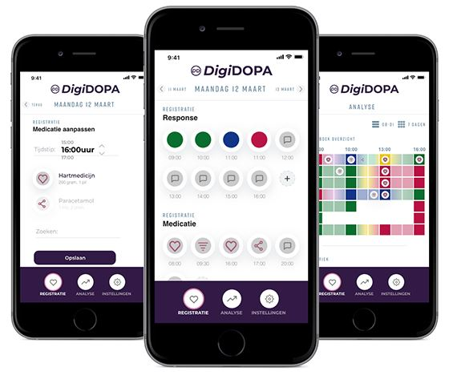
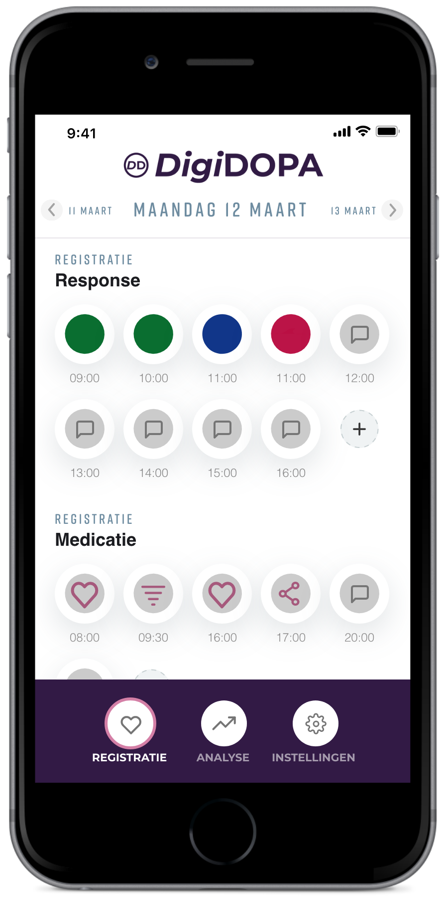

+++
title = "Home - DigiDOPA"
template = "index.html"
+++

## Digitale Dagelijkse Observatie van Parkinson Activiteit

Voor dagelijkse registratie van medicatie effecten bij Parkinsonpatiënten.

Een optimale persoonlijke afstelling van medicijngebruik voor elke Parkinsonpatiënt, dat kan met DigiDOPA. Deze app registreert medicatiemomenten en de respons daarop, zodat patiënt en arts samen de hoeveelheid medicijnen en innamemomenten kunnen aanpassen, resulterend in een verbetering van de Parkinsonklachten.

[De DigiDOPA aanpak](/werkwijze)

{{ download_app() }}

## Stel medicatie optimaal af met gebruik van de DigiDOPA app

1. Stel medicatie inname, meetperiode en -momenten in
2. Registreer bij elk alarm de actuele conditie
3. Kijk gegevens terug en vul waar nodig bij
4. Analyseer en stuur bij met de behandelend arts

## DigiDOPA

Zorg & ICT slaan de handen inéén om Parkinsonpatiënten, met deze app zetten we ons in voor:

- Juiste registratie van symptomen met weinig tijdverlies
- Beter inzicht in het behandelproces
- Meer inspraak in behandeling (Shared-decision making)
- Minder bijwerkingen door effectievere medicatie inname
- Betere kwaliteit van leven
